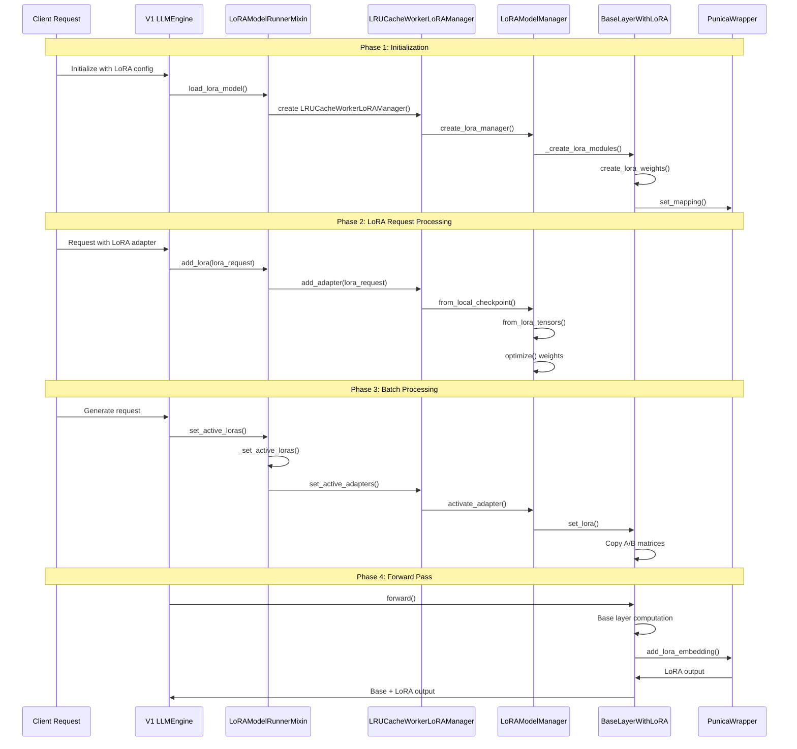

# vLLM V1 LoRA Weight Loading Sequence Diagram



## Key Function Call Chain

### 1. Initialization Chain
```
V1 LLMEngine.__init__()
  └─ LoRAModelRunnerMixin.load_lora_model()
    └─ LRUCacheWorkerLoRAManager.__init__()
      └─ LoRAModelManager._create_lora_modules()
        └─ BaseLayerWithLoRA.create_lora_weights()
```

### 2. LoRA Loading Chain
```
LoRAModelRunnerMixin.add_lora()
  └─ LRUCacheWorkerLoRAManager.add_adapter()
    └─ LoRAModel.from_local_checkpoint()
      └─ LoRAModel.from_lora_tensors()
        └─ LoRALayerWeights.optimize()
```

### 3. Activation Chain
```
LoRAModelRunnerMixin.set_active_loras()
  └─ LRUCacheWorkerLoRAManager.set_active_adapters()
    └─ LoRAModelManager.activate_adapter()
      └─ BaseLayerWithLoRA.set_lora()
        └─ Copy lora_a, lora_b matrices
```

### 4. Forward Pass Chain
```
BaseLayerWithLoRA.forward()
  ├─ Base layer computation
  ├─ LoRA A matrix multiplication
  ├─ PunicaWrapper.add_lora_embedding()
  └─ Add LoRA output to base output
```

## File Location Quick Reference

| Component | File Path |
|-----------|-----------|
| **V1 Engine** | `vllm/v1/engine/llm_engine.py` |
| **LoRA Mixin** | `vllm/v1/worker/lora_model_runner_mixin.py` |
| **Worker Manager** | `vllm/lora/worker_manager.py` |
| **Model Manager** | `vllm/lora/models.py` |
| **Layer Implementation** | `vllm/lora/layers.py` |
| **Weight Classes** | `vllm/lora/lora.py` |
| **Request Definition** | `vllm/lora/request.py` |
| **Punica Wrapper** | `vllm/lora/punica_wrapper/` |

## Critical Performance Points

1. **GPU Slot Management**: Limited slots (4-8) for active LoRAs
2. **LRU Eviction**: Automatic eviction of least recently used LoRAs
3. **Weight Optimization**: Scaling factors merged into B matrices
4. **Batch Processing**: Efficient token-to-LoRA mapping
5. **Punica Kernels**: GPU-optimized LoRA computation

This sequence diagram shows the complete flow from initialization to forward pass, highlighting the key interactions between components in the vLLM V1 LoRA system.