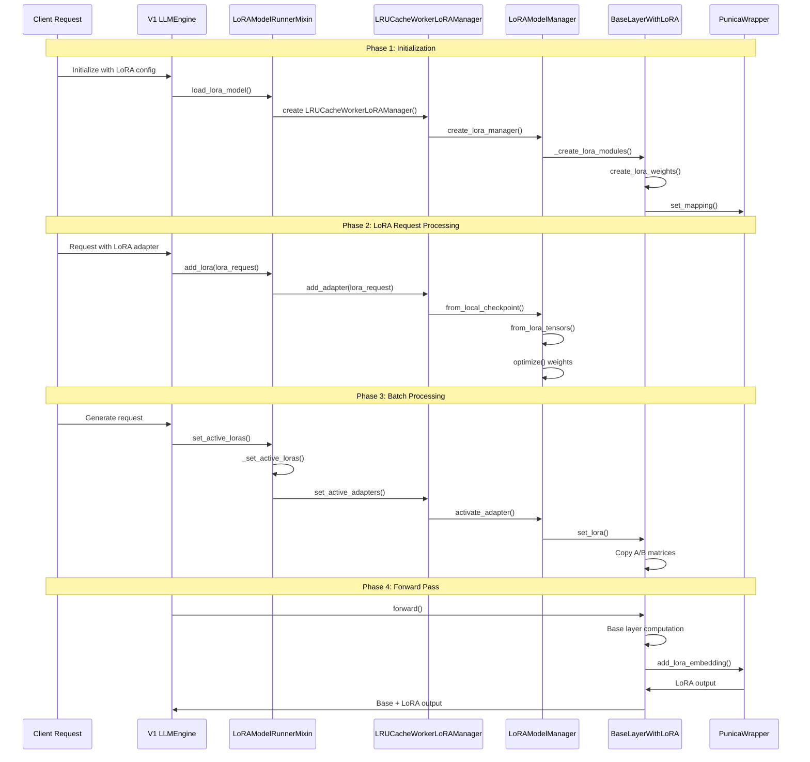

# vLLM V1 LoRA Weight Loading Sequence Diagram



## Key Function Call Chain

### 1. Initialization Chain
```
V1 LLMEngine.__init__()
  └─ LoRAModelRunnerMixin.load_lora_model()
    └─ LRUCacheWorkerLoRAManager.__init__()
      └─ LoRAModelManager._create_lora_modules()
        └─ BaseLayerWithLoRA.create_lora_weights()
```

### 2. LoRA Loading Chain
```
LoRAModelRunnerMixin.add_lora()
  └─ LRUCacheWorkerLoRAManager.add_adapter()
    └─ LoRAModel.from_local_checkpoint()
      └─ LoRAModel.from_lora_tensors()
        └─ LoRALayerWeights.optimize()
```

### 3. Activation Chain
```
LoRAModelRunnerMixin.set_active_loras()
  └─ LRUCacheWorkerLoRAManager.set_active_adapters()
    └─ LoRAModelManager.activate_adapter()
      └─ BaseLayerWithLoRA.set_lora()
        └─ Copy lora_a, lora_b matrices
```

### 4. Forward Pass Chain
```
BaseLayerWithLoRA.forward()
  ├─ Base layer computation
  ├─ LoRA A matrix multiplication
  ├─ PunicaWrapper.add_lora_embedding()
  └─ Add LoRA output to base output
```

## File Location Quick Reference

| Component | File Path |
|-----------|-----------|
| **V1 Engine** | `vllm/v1/engine/llm_engine.py` |
| **LoRA Mixin** | `vllm/v1/worker/lora_model_runner_mixin.py` |
| **Worker Manager** | `vllm/lora/worker_manager.py` |
| **Model Manager** | `vllm/lora/models.py` |
| **Layer Implementation** | `vllm/lora/layers.py` |
| **Weight Classes** | `vllm/lora/lora.py` |
| **Request Definition** | `vllm/lora/request.py` |
| **Punica Wrapper** | `vllm/lora/punica_wrapper/` |

## Critical Performance Points

### Memory Management
1. **GPU Slot Allocation**: Limited slots (4-8) for active LoRAs
2. **LRU Eviction**: Automatic eviction of least recently used LoRAs  
3. **Memory Pinning**: CPU tensors pinned for faster GPU transfers
4. **Tensor Optimization**: Pre-optimized weight layouts for GPU access

### Computation Optimization
5. **Scaling Factor Merge**: Pre-computation during loading phase
6. **Batch Processing**: Efficient token-to-LoRA mapping
7. **Punica Kernels**: GPU-optimized LoRA computation kernels
8. **Packed Modules**: Combined processing of related modules (qkv_proj)

### Caching Strategy
9. **Two-Level Cache**: GPU (active) + CPU (inactive) caching
10. **Predictive Loading**: Anticipatory LoRA loading based on patterns
11. **Memory Fragmentation**: Contiguous memory allocation for efficiency
12. **Garbage Collection**: Automatic cleanup of unused LoRA weights

## Detailed Performance Metrics

### Timing Breakdown
```python
# Performance timing breakdown
class LoRAPerformanceProfiler:
    def __init__(self):
        self.timings = {
            "initialization": [],      # Model setup time
            "loading": [],            # Disk I/O and parsing
            "optimization": [],       # Weight optimization
            "activation": [],         # GPU slot assignment
            "forward_pass": [],       # Inference computation
            "memory_transfer": []     # CPU-GPU transfers
        }
        
    def profile_initialization(self, model_config: ModelConfig):
        start_time = time.time()
        # ... initialization code ...
        self.timings["initialization"].append(time.time() - start_time)
        
    def profile_loading(self, lora_path: str):
        start_time = time.time()
        # ... loading code ...
        self.timings["loading"].append(time.time() - start_time)
        
    def get_performance_summary(self) -> Dict[str, float]:
        return {
            phase: sum(times) / len(times) if times else 0.0
            for phase, times in self.timings.items()
        }
```

### Memory Usage Patterns
```python
# Memory usage tracking
class LoRAMemoryTracker:
    def __init__(self):
        self.gpu_memory_usage = []
        self.cpu_memory_usage = []
        self.peak_usage = {"gpu": 0, "cpu": 0}
        
    def track_gpu_memory(self, lora_id: int, operation: str):
        current_usage = torch.cuda.memory_allocated()
        self.gpu_memory_usage.append({
            "lora_id": lora_id,
            "operation": operation,
            "memory_mb": current_usage / 1024 / 1024,
            "timestamp": time.time()
        })
        
        if current_usage > self.peak_usage["gpu"]:
            self.peak_usage["gpu"] = current_usage
            
    def get_memory_efficiency(self) -> Dict[str, float]:
        if not self.gpu_memory_usage:
            return {"efficiency": 0.0}
            
        # Calculate memory efficiency metrics
        total_allocations = len(self.gpu_memory_usage)
        peak_mb = self.peak_usage["gpu"] / 1024 / 1024
        avg_mb = sum(entry["memory_mb"] for entry in self.gpu_memory_usage) / total_allocations
        
        return {
            "peak_usage_mb": peak_mb,
            "average_usage_mb": avg_mb,
            "memory_efficiency": avg_mb / peak_mb if peak_mb > 0 else 0.0,
            "total_allocations": total_allocations
        }
```

## Advanced Debugging Tools

### LoRA System Inspector
```python
# Comprehensive system inspection
class LoRASystemInspector:
    def __init__(self, lora_manager: LoRAModelManager):
        self.lora_manager = lora_manager
        
    def inspect_lora_layers(self) -> Dict[str, Any]:
        """Inspect all LoRA layers in the model."""
        layer_info = {}
        
        for name, module in self.lora_manager.model.named_modules():
            if hasattr(module, 'lora_a_stacked'):
                layer_info[name] = {
                    "lora_slots": module.lora_a_stacked.shape[0],
                    "max_rank": module.lora_a_stacked.shape[1],
                    "input_dim": module.lora_a_stacked.shape[2],
                    "output_dim": module.lora_b_stacked.shape[1],
                    "active_loras": self._count_active_loras(module),
                    "memory_usage_mb": self._calculate_layer_memory(module)
                }
                
        return layer_info
        
    def _count_active_loras(self, module: nn.Module) -> int:
        """Count active LoRAs in a layer."""
        active_count = 0
        for i in range(module.lora_a_stacked.shape[0]):
            # Check if slot has non-zero weights
            if torch.any(module.lora_a_stacked[i] != 0):
                active_count += 1
        return active_count
        
    def _calculate_layer_memory(self, module: nn.Module) -> float:
        """Calculate memory usage for a LoRA layer."""
        # A matrix memory
        a_memory = module.lora_a_stacked.numel() * module.lora_a_stacked.element_size()
        # B matrix memory  
        b_memory = module.lora_b_stacked.numel() * module.lora_b_stacked.element_size()
        # Total in MB
        return (a_memory + b_memory) / 1024 / 1024
        
    def generate_inspection_report(self) -> str:
        """Generate a detailed inspection report."""
        layer_info = self.inspect_lora_layers()
        memory_stats = self.lora_manager.get_memory_stats()
        
        report = ["=== LoRA System Inspection Report ===\n"]
        
        # Summary
        report.append(f"Total LoRA Layers: {len(layer_info)}")
        report.append(f"Active LoRAs: {len(self.lora_manager.list_active_adapters())}")
        report.append(f"GPU Memory Usage: {memory_stats.get('gpu_mb', 0):.2f} MB")
        report.append(f"CPU Memory Usage: {memory_stats.get('cpu_mb', 0):.2f} MB\n")
        
        # Layer Details
        report.append("=== Layer Details ===")
        for layer_name, info in layer_info.items():
            report.append(f"Layer: {layer_name}")
            report.append(f"  Slots: {info['lora_slots']}")
            report.append(f"  Max Rank: {info['max_rank']}")
            report.append(f"  Dimensions: {info['input_dim']} -> {info['output_dim']}")
            report.append(f"  Active LoRAs: {info['active_loras']}")
            report.append(f"  Memory: {info['memory_usage_mb']:.2f} MB")
            report.append("")
            
        return "\n".join(report)
```

### Performance Regression Detection
```python
# Performance regression detection
class LoRAPerformanceRegression:
    def __init__(self, baseline_file: str = "lora_baseline.json"):
        self.baseline_file = baseline_file
        self.baseline_metrics = self._load_baseline()
        
    def _load_baseline(self) -> Dict[str, float]:
        """Load baseline performance metrics."""
        try:
            with open(self.baseline_file, 'r') as f:
                return json.load(f)
        except FileNotFoundError:
            return {}
            
    def record_baseline(self, metrics: Dict[str, float]):
        """Record new baseline metrics."""
        self.baseline_metrics = metrics
        with open(self.baseline_file, 'w') as f:
            json.dump(metrics, f, indent=2)
            
    def detect_regression(self, current_metrics: Dict[str, float]) -> Dict[str, Any]:
        """Detect performance regressions."""
        regressions = {}
        
        for metric_name, current_value in current_metrics.items():
            if metric_name not in self.baseline_metrics:
                continue
                
            baseline_value = self.baseline_metrics[metric_name]
            change_percent = ((current_value - baseline_value) / baseline_value) * 100
            
            # Flag significant regressions (>10% worse)
            if change_percent > 10:
                regressions[metric_name] = {
                    "baseline": baseline_value,
                    "current": current_value,
                    "change_percent": change_percent,
                    "severity": "high" if change_percent > 25 else "medium"
                }
                
        return regressions
```

This sequence diagram shows the complete flow from initialization to forward pass, highlighting the key interactions between components in the vLLM V1 LoRA system.